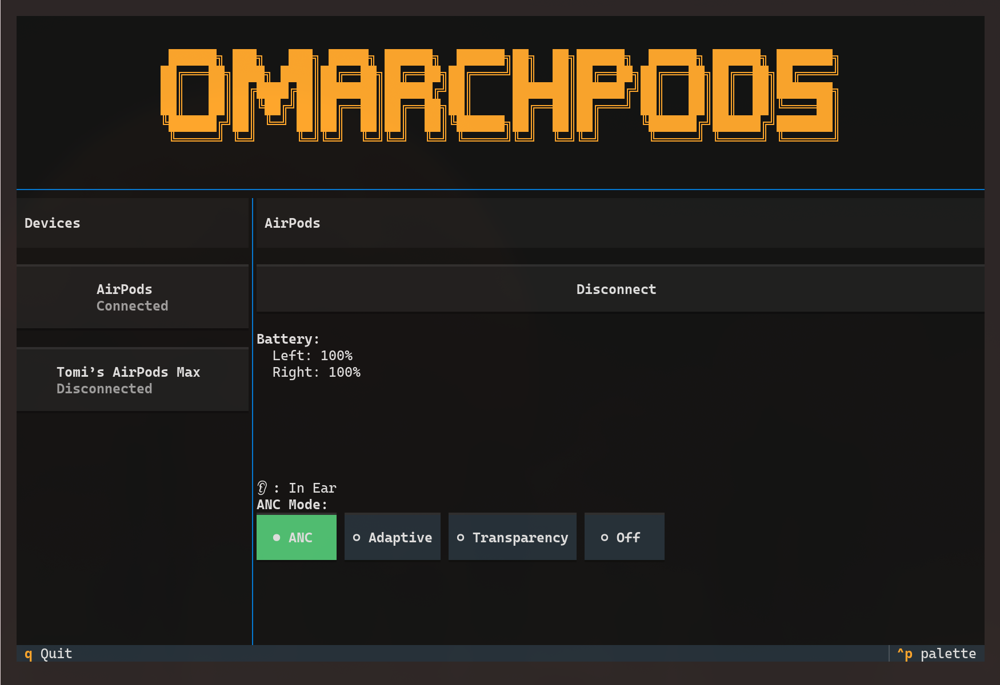

# Omarchpods

It's early in development, so there may be some bugs, feel free to report them by creating an issue. Ideas are also welcome.

## Preview


> **Note:** This project is new and has only been tested with the my AirPods. While the supported devices list below is inherited from MagicPodsCore, not all devices have been verified to work with this fork. PRs for testing and fixing specific devices are welcome!

A fork of [MagicPodsCore](https://github.com/steam3d/MagicPodsCore) with a TUI, designed for Omarchy.

## Install

```
git clone git@github.com:tomycostantino/omarchpods.git && \
cd omarchpods && \
bash install.sh
```

### Heads up

It will take a little bit of time to compile the C++ code, so please be patient during this step.

The UI can be launched with:

```bash
omarchy-launch-omarchpods
```

## Optional Configuration

### Waybar Integration

To add Omarchpods to your waybar, add a custom module to your waybar config (`~/.config/waybar/config`):

At the top of the file add `"custom/omarchpods"` to the module you'd like the icon:

```json
  "modules-left": [...],
  "modules-center": [...],
  "modules-right": [
    ...,
    "custom/omarchpods"
  ],
```

Then all the way to the bottom go:

```json
"custom/omarchpods": {
    "format": " 🎧 ",
    "on-click": "omarchy-launch-omarchpods",
    "tooltip": false
}
```

### Keyboard Binding (Hyprland)

To add a keyboard shortcut to open Omarchpods UI with `SUPER + SHIFT + H` (or any other you'd like), add this to your Hyprland config (`~/.config/hypr/hyprland.conf`):

```
bind = SUPER SHIFT, H, exec, omarchy-launch-omarchpods
```

## 🎧 Headphones supported

| Apple            | Beats                  | Samsung           |
| ---------------- | ---------------------- | ----------------- |
| AirPods 1        | PowerBeats Pro         | Galaxy Buds       |
| AirPods 2        | PowerBeats Pro 2       | Galaxy Buds Plus  |
| AirPods 3        | PowerBeats 3           | Galaxy Buds Live  |
| AirPods 4        | PowerBeats 4           | Galaxy Buds Pro   |
| AirPods 4 (ANC)  | Beats Fit Pro          | Galaxy Buds 2     |
| AirPods Pro      | Beats Studio Buds      | Galaxy Buds 2 Pro |
| AirPods Pro 2    | Beats Studio Buds Plus | Galaxy Buds Fe    |
| AirPods Pro 3    | Beats Studio Pro       | Galaxy Buds 3     |
| AirPods Max      | Beats Solo 3           | Galaxy Buds 3 Pro |
| AirPods Max 2024 | Beats Solo Pro         |                   |
|                  | Beats Studio 3         |                   |
|                  | Beats X                |                   |
|                  | Beats Flex             |                   |
|                  | Beats Solo Buds        |                   |

Original MagicPodsCore developed by [Aleksandr Maslov](https://github.com/steam3d/) and [Andrey Litvintsev](https://github.com/andreylitvintsev)

Fork developed by [Tomas Costantino](https://github.com/tomycostantino/)
